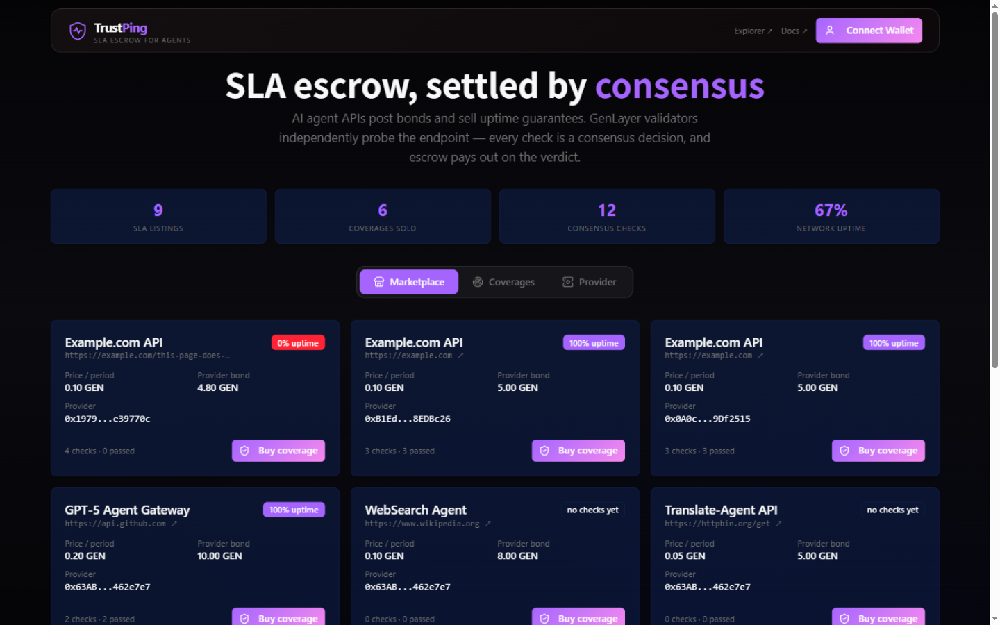
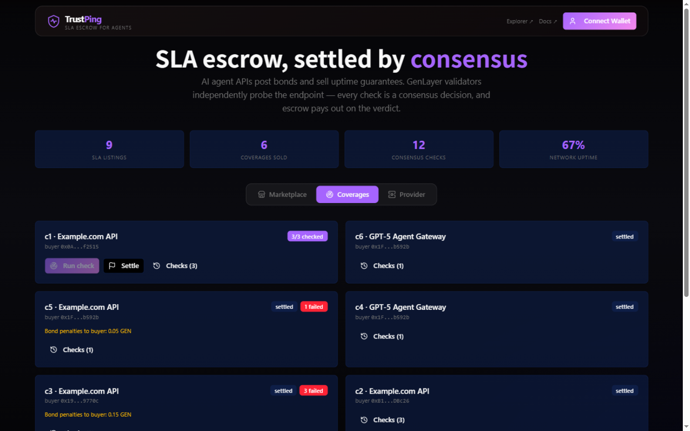

# TrustPing — SLA escrow, settled by consensus

TrustPing is trustless SLA (service-level agreement) enforcement for AI agent
services, built on [GenLayer](https://genlayer.com) and deployed on **Studio
Next** (Consensus v0.6). Agent API providers post a **GEN bond** and list an
SLA for an HTTP endpoint. Buyers pre-pay monitoring periods into **on-chain
escrow**. Anyone can trigger a check — permissionless keeper — and GenLayer
validators **independently re-fetch the endpoint** and reach consensus on
whether the service was up. Passed periods pay the provider; failed periods
refund the buyer **plus a penalty taken from the provider's bond**.

**Live app:** https://trustping-gray.vercel.app
**Live contract (Studio Next / chain 61997):**
`0xE90E0960AB1c18DA979730f8f3c1802Ad41782CB`
→ [explorer](https://explorer-studio-dev.genlayer.com/address/0xE90E0960AB1c18DA979730f8f3c1802Ad41782CB)



## What works today

The live flow on Studio Next supports any HTTP endpoint:

- Providers list an SLA with a **bonded stake** (bond is real collateral held
  by the contract, returned only when no active coverage remains).
- Buyers pre-pay N monitoring periods into contract **escrow** (exact-payment
  enforced).
- A **permissionless keeper** triggers checks — no monitoring operator
  exists; anyone can run the probe.
- Every check is a **consensus decision**: the leader fetches the endpoint and
  every validator re-fetches it independently and compares the derived
  verdict (`up` + HTTP status class).
- **Failure compensation is automatic**: each failed check refunds that
  period's price to the buyer **plus a bond penalty** (half a period's price,
  capped by the bond) — visible on-chain as "Bond penalties to buyer".
- **Settlement splits the escrow by consensus results** via transfer child
  messages, with full per-period verdict history and aggregate uptime stats
  queryable on-chain.
- **Frontend** (Next.js, fully client-side): Marketplace with live uptime
  badges, Coverages with check history / settle / early cancel, Provider with
  bond management, and per-transaction v0.6 fee estimation including message
  allocations.



An HTTP 200 proves the endpoint answered once. It does **not**, by itself,
prove the service is reliable — which is exactly why the verdict is not taken
from a single fetch: validators probe independently, transient network
failures only agree when both sides hit them, and every substantive
disagreement rotates the leader.

## What GenLayer does

The endpoint URL is the evidence source; nothing about it is trusted. The
contract owns the minimum state transition that needs consensus:

- **Leader**: `gl.nondet.web.get(endpoint)` → derives stable decision fields
  (`up`: 2xx/3xx, `status_class`: `"200xx"`, `"404xx"`, …).
- **Validator**: re-runs the same probe in its own context and compares the
  derived fields. `up` and `status_class` must match exactly. Raw latency is
  deliberately kept out of consensus — validator timing jitter would
  destabilize agreement.
- **Errors are classified** with `[TRANSIENT]` prefixes: a validator agrees
  with a leader error only when it independently hits the same transient
  failure; any substantive disagreement returns `False` and forces leader
  rotation.
- The accepted verdict, the full per-period history, bond balances, and
  settlement splits are stored on-chain; disputes can use GenLayer v0.6's
  native appeal mechanism.

Contract boundary:

| Owns | Details |
|---|---|
| **Frontend** | UI, wallet, tx status, caching — no backend; reads go straight to the GenLayer RPC |
| **Contract** | Escrow accounting, bond penalties, verdict storage, settlement splits |
| **Evidence source** | The endpoint itself — validators re-fetch it; nothing is trusted |

## Verify it in 5 minutes — no local setup needed

**Step 0.** Set up a wallet once:
1. Install [MetaMask](https://metamask.io/download/) if you don't have it.
2. Add the GenLayer Studio Next network to MetaMask:
   RPC `https://studio-next.genlayer.com/api` · Chain ID `61997` · Symbol `GEN`.
3. Get free test GEN into your MetaMask wallet — call the dev faucet with
   your address (funds 50 test GEN; deposits and bonds are refunded at
   settlement, so a small balance goes a long way):
   ```bash
   curl -X POST https://studio-next.genlayer.com/api -H "Content-Type: application/json"      -d '{"jsonrpc":"2.0","id":1,"method":"sim_fundAccount","params":["0xYOUR_ADDRESS","0x56BC75E2D63100000"]}'
   ```
   (The Studio web app at https://studio-dev.genlayer.com also has a 💧
   **Fund account** button, but it funds the Studio's own embedded account —
   use the curl above to fund your MetaMask address.)

**Step 1.** Open the live app: **https://trustping-gray.vercel.app**
Connect MetaMask when prompted (accept the network add/switch).

**Step 2.** The **Marketplace** tab lists live SLAs with on-chain uptime
stats. Click **Buy coverage** on a listing (e.g. 3 periods × 0.1 GEN) —
confirm in MetaMask and the GEN moves into contract escrow.

**Step 3.** Open the **Coverages** tab and hit **Run check**: GenLayer
validators independently fetch the endpoint, consensus agrees on the
verdict (`UP` / `200xx`), and the check is recorded on-chain with the full
history. Nobody's word is trusted — every verdict is a consensus decision.

**Step 4.** After the last period is checked, hit **Settle**: the escrow
splits itself — passed periods pay the provider, the rest is refunded.

**Step 5.** To see the breach path, buy coverage on the **"404 Test (dead
endpoint)"** listing: every check returns `DOWN / 400xx`, and failed checks
refund the buyer **plus a penalty taken from the provider's bond** — visible
as "Bond penalties to buyer" on the coverage card.

Headless alternative: `node scripts/smoke.mjs 0xE90E0960AB1c18DA979730f8f3c1802Ad41782CB`
runs the same lifecycle with an ephemeral faucet-funded account.

**Local development:** see [Development](#development) — four steps from a
clean machine to a running frontend.

## Repo layout

```
contracts/sla_escrow.py        TrustPingEscrow intelligent contract
tests/direct/                  25 fast in-memory tests (mocked HTTP probes)
tests/integration/             Full-consensus tests on Studio Devnet
scripts/smoke.mjs              Headless end-to-end lifecycle on studio-next
frontend/                      Next.js app (genlayer-js 2.0.0-rc.1, MetaMask provider bridge)
deploy/deployScript.ts         Deployment script (genlayer-js)
```

## Development

### Prerequisites

- **Node.js ≥ 18** and npm (frontend + tooling)
- **Python ≥ 3.12** and pip (contract, tests, linter)
- **MetaMask** (for using the frontend and signing transactions)
- Optional: the GenLayer CLI (`npm install -g genlayer`) for contract
  deployment. `genvm-lint` comes with the Python requirements and needs no
  separate install.

### Local setup

```bash
# 1. Python environment (contract + tests + genvm-lint)
python -m venv .venv
.venv/Scripts/pip install -r requirements.txt      # Linux/macOS: .venv/bin/pip

# 2. Node dependencies (root workspace + frontend)
npm ci

# 3. Frontend environment — copy the example and adjust if needed
cd frontend && cp .env.example .env && cd ..
#    .env already points at Studio Next (chain 61997) and the deployed
#    TrustPingEscrow contract address.

# 4. Start the frontend
cd frontend && npm run dev        # → http://localhost:3000
```

### Verify your setup

```bash
# Lint the contract (static checks + SDK validation against the pinned runner)
.venv/Scripts/genvm-lint check contracts/sla_escrow.py

# Fast direct tests — in-memory, mocked HTTP, no network needed
.venv/Scripts/python -m pytest tests/direct/ -v

# Full consensus integration tests on Studio Next (real validators, ~2 min)
.venv/Scripts/gltest tests/integration/test_sla_escrow.py -v -s

# Headless end-to-end lifecycle (funds a temp account via the dev faucet)
node scripts/smoke.mjs <contractAddress>
```

### Deploy the contract

```bash
genlayer network set studio-dev
genlayer deploy --contract contracts/sla_escrow.py   --fees '{"distribution":{"leaderTimeunitsAllocation":"100","validatorTimeunitsAllocation":"200","appealRounds":"0","executionBudgetPerRound":"25000000000000000","executionConsumed":"0","totalMessageFees":"0","rotations":["3"],"maxPriceGenPerTimeUnit":"2","storageFeeMaxGasPrice":"300000000","receiptFeeMaxGasPrice":"300000000"}}'   --fee-value 100000000000010352
```

Then set the deployed address as `NEXT_PUBLIC_CONTRACT_ADDRESS` in
`frontend/.env` and restart the dev server.

## License

MIT
